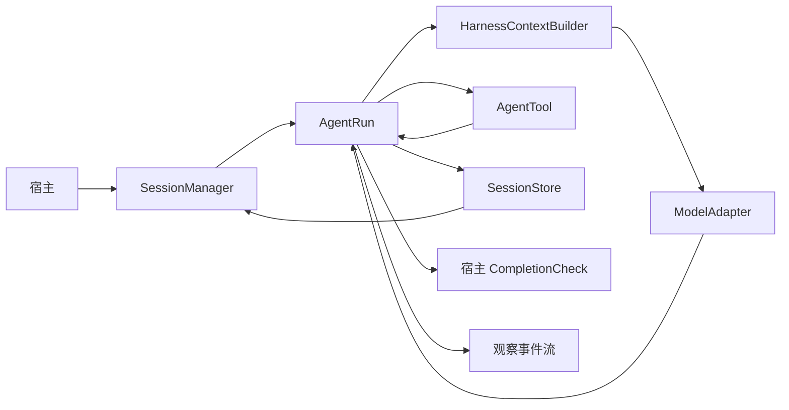

# cutdex_agent 架构

本文介绍模块分工和执行顺序。接入方式见 [README](../README.md)，使用方法见 [运行控制](runtime.md) 和 [长任务与上下文](long-running-agent.md)。

## 职责与依赖

核心是独立的纯 Dart 包。宿主通过接口注入模型、工具、存储，以及可选的技能、记忆和完成检查。外部资源的版本、事务、授权和业务任务生命周期由工具宿主负责。

| 模块 | 当前职责 |
| --- | --- |
| `SessionManager` | 创建会话、启动或恢复 Run、获取写入租约、手动压缩 |
| `AgentRun` | 模型与工具循环、检查点提交、追加指令、暂停、取消和恢复 |
| `HarnessContextBuilder` | 选择工具、提供大结果读取入口、将计划和所需历史加入请求 |
| `ContextBuilder` / `ModelContextSummarizer` | 控制输入大小、加入技能和记忆、摘要较早的历史 |
| `ModelAdapter` | 模型请求和流式响应契约；IO 入口提供三种 HTTP 协议实现 |
| `AgentTool` | 定义宿主参数校验、执行和恢复接口；由 AgentRun 串行调度并关联操作 ID |
| `SessionStore` | 保存历史和执行状态，通过独占写入权限和版本检查防止冲突 |
| `AgentCoordinator` | 创建子任务、限制数量与轮次、维护父子关系和传播取消 |
| `CompletionCheck` | 宿主注入的只读结果核验，证据保存至会话 |
| `SkillProvider` / `MemoryProvider` | 按宿主选定技能加载、按可信作用范围检索；写入由宿主显式调用 |

## 执行与数据流

每轮执行先选择请求内容，再调用模型。模型适配器收齐工具参数后，返回完整调用。运行层串行执行工具，将结果加入历史，再开始下一轮。

Run 先持久化调用意图和开始状态，再执行工具，然后保存结果。存储失败时停止后续副作用。宿主通过事件订阅观察进度，通过运行控制方法调整执行；运行层负责调度和持久化。使用 `AgentRun.phase` 区分上下文整理与响应阶段。

## 保存、恢复与完成

`SessionStore` 保存完整历史和执行状态。恢复时，运行层先通过工具的 `recover` 查询未完成操作，再决定继续等待、补记结果或重试。调用方式见 [运行控制](runtime.md)，磁盘格式见 [会话存储](session-storage.md)。

模型准备结束时，运行层检查计划是否还有待办，并调用宿主配置的 `completionCheck` 核验结果。任务继续运行时沿用原轮次预算。

## 子任务、技能和记忆

协调器为每个子任务创建独立会话，记录父会话和父 Run。子工具名称须属于父集合，同名工具应具有一致的权限和行为。父任务等待受管子任务结束，并向它们传播取消。

宿主汇总子任务结果。跨进程恢复时，先恢复各子会话，再重建它们的依赖关系。

宿主指定技能 ID，由提供方加载正文；缺失、身份不匹配、工具越权或超预算时明确失败。技能发现和脚本执行由宿主按业务需求接入。

记忆按宿主提供的 `scope`（检索范围）读取。宿主决定何时写入和删除；变更在后续请求中生效，需要停止当前请求时调用取消。

> ⚠️ 操作系统沙箱、技能自动发现和跨进程任务依赖恢复需由宿主提供。
